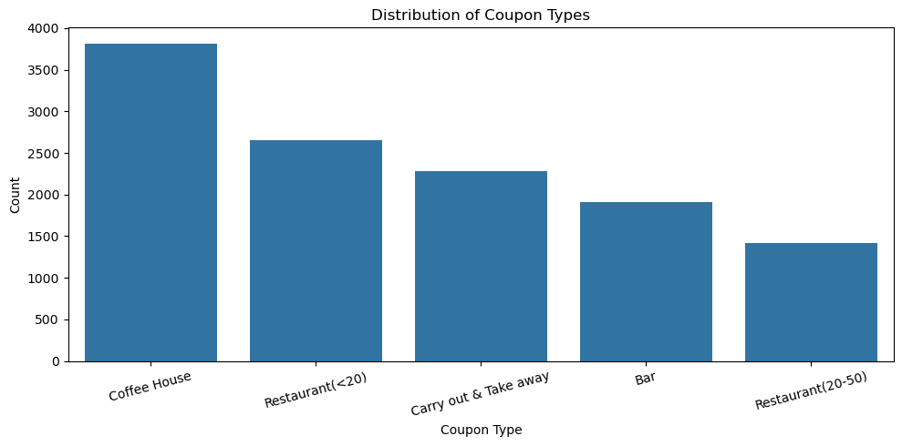
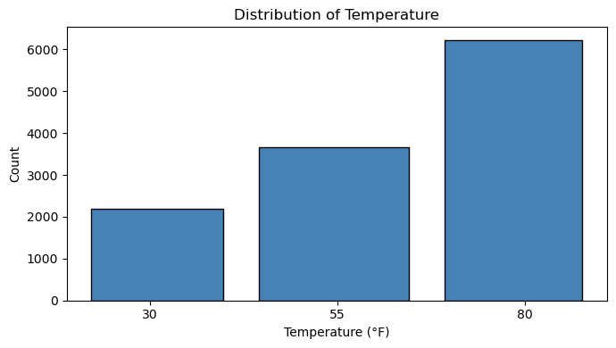
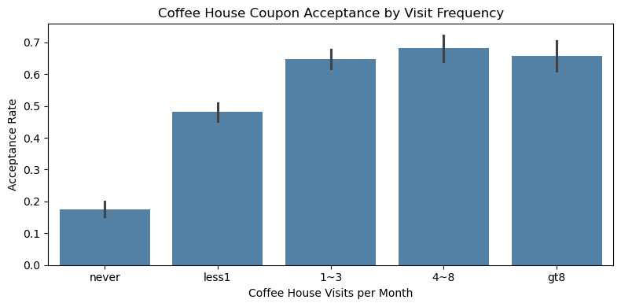
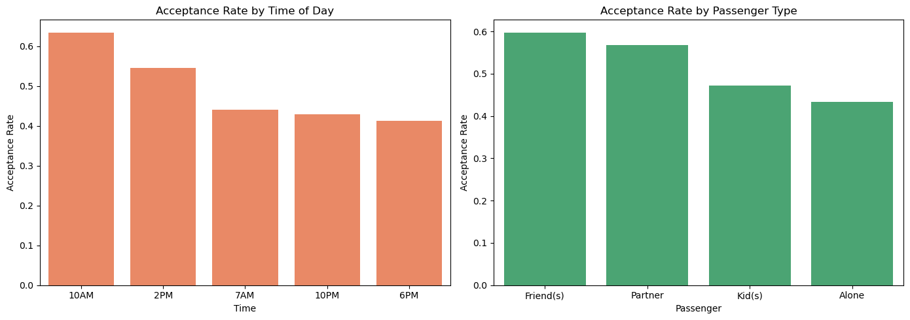

# Will the Customer Accept the Coupon?

**UC Berkeley MLAI Practical Application 5.1**

## Overview

Analysis of a driving coupon dataset from the UCI Machine Learning repository to identify characteristics of drivers who accept coupons delivered to their cell phone while driving.

The dataset contains 12,684 survey responses describing driving scenarios (destination, weather, passenger, time of day, etc.) and whether the driver accepted the coupon. Coupon types: Bar, Coffee House, Carry Out & Take Away, Restaurant (<$20), Restaurant ($20–$50).

## Data Preparation

- Dropped the `car` column (99.1% missing values)
- Dropped rows with remaining NaN values (~605 rows)
- Final dataset: **12,079 rows**
- **Overall coupon acceptance rate: 56.93%**

## Coupon Type Distribution

## Temperature Distribution

---

## Bar Coupon Analysis

**Bar coupon acceptance rate: 41.19%**

| Group | Acceptance Rate |
|---|---|
| Bar visits ≤3/month | 37.27% |
| Bar visits >3/month | 76.17% |
| Bar >1/month AND age >25 | 68.98% |
| Bar >1/month, no kids, non-farming occupation | 70.94% |
| Bar >1/month, age <30 | 71.95% |

### Hypothesis: Bar Coupon Acceptors

Drivers likely to accept bar coupons tend to be:

- **Frequent bar-goers** (strongest predictor — 76% vs 37% acceptance)
- **Not traveling with children**
- **Younger adults (under 30)**
- **Not widowed**
- Outside farming, fishing, and forestry occupations

---

## Independent Investigation: Coffee House Coupons

**Coffee House coupon acceptance rate: 49.63%** (3,816 observations)

### Acceptance by Visit Frequency

### Acceptance by Time of Day and Passenger Type

### Key Findings

1. **Existing habits predict acceptance**: Drivers who already visit coffee houses 1–3+ times/month accept at ~65–70% vs ~40% for infrequent visitors.
2. **Time of day matters**: Morning (10AM) and afternoon (2PM) coupons outperform evening (6PM), matching typical coffee-drinking behavior.
3. **Passenger type influences acceptance**: Drivers alone or with friends accept more readily than those with kids or a partner.

### Conclusion

The ideal coffee house coupon target is a **regular coffee drinker, driving alone or with friends, contacted during morning or afternoon hours**. Campaigns should prioritize habitual visitors and morning/midday delivery windows.

---

## Files

- `prompt.ipynb` — Full analysis notebook
- `data/coupons.csv` — Dataset
- `images/plots/` — Generated visualizations
